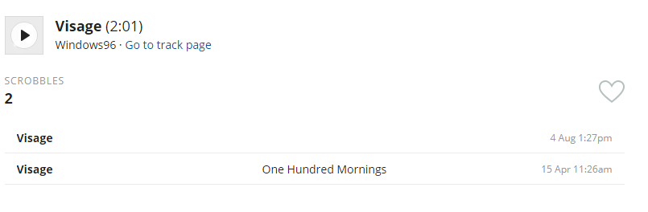
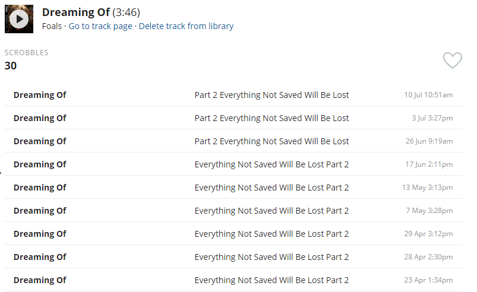

# PatchFM

PatchFM is a tool that aims at making your LastFM scrobbles more accurate.

# Inaccurate Scrobble

Here's the current inaccuracies that PatchFM tries to fix.

1. Scrobble having an empty album 
2. Different album name for the same song 

If you encounter an inaccuracy not taken into consideration by this tool, feel free to open an issue in this repo.

# How to execute it

Download the appropriate exectuable on the [release](https://github.com/pnolin/PatchFm/releases) page.
Run the executable!

# Fixing the inaccuracies

Since the LastFm API doesn't allow editing nor deleting Scrobbles, the tool can't do that.
Instead, the tool will create a file under the ".\patches\[date]-patch-fm.txt" file. 
Where [date] is replaced by the date at which the tool is ran in the format yyyy-mm-dd.

The patches folder is created in the same folder where the executable is.

The file contains a list of suggested transformations that when applied will make your LastFm statistics more accurate.
These transformations can be applied manually in LastFm since it allows editting scrobbles.

# Contributing

The only non-technical prerequisite to build and run the application is to have an LastFm Api Key and Secret.
You can create that [here](https://www.last.fm/api/account/create)

Pull Requests are welcome!